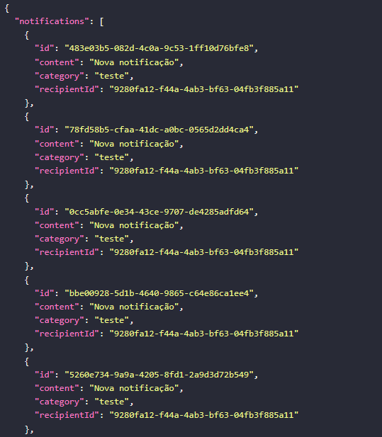

<h1 align="center">
  Notifications Service
</h1>

<p align="center">
  <a href="#-Methods"><b>Methods</b></a>&nbsp;&nbsp;&nbsp;|&nbsp;&nbsp;&nbsp;
  <a href="#-Technologies"><b>Technologies</b></a>&nbsp;&nbsp;&nbsp;|&nbsp;&nbsp;&nbsp;
  <a href="#-Project"><b>Project</b></a>&nbsp;&nbsp;&nbsp;
</p>

---

<div align="center">
  
</div> 

<br></br>

## 🚀 Getting started

Clone the project and access the folder.

```bash
$ git clone https://github.com/diaspd/notifications-service.git
$ cd 
```

## Installation

```bash
$ npm install
```

## Running the app

```bash
# development
$ npm run start

# watch mode
$ npm run start:dev

# production mode
$ npm run start:prod
```

## Test

```bash
# unit tests
$ npm run test

# e2e tests
$ npm run test:e2e

# test coverage
$ npm run test:cov
```

## 🌐 Methods: 

 POST to create notifications: `http://localhost:3000/notifications` </br>
 GET to count: `http://localhost:3000/notifications/count/from/{id}` </br>
 GET notification: `http://localhost:3000/notifications/from/{id}`

<br></br>

## 💻 Technologies

This project was developed with the following technologies:
<b>
- NestJs
- NodeJs
- Prisma
</b>

</br>

## 📄 Project
💰 Project to create and show notifications with back end.

<br></br>

Made with ♥ by Pedro Dias. 👋 Follow me on social media! </br>

If you can give a little star, I appreciate it 🤩
